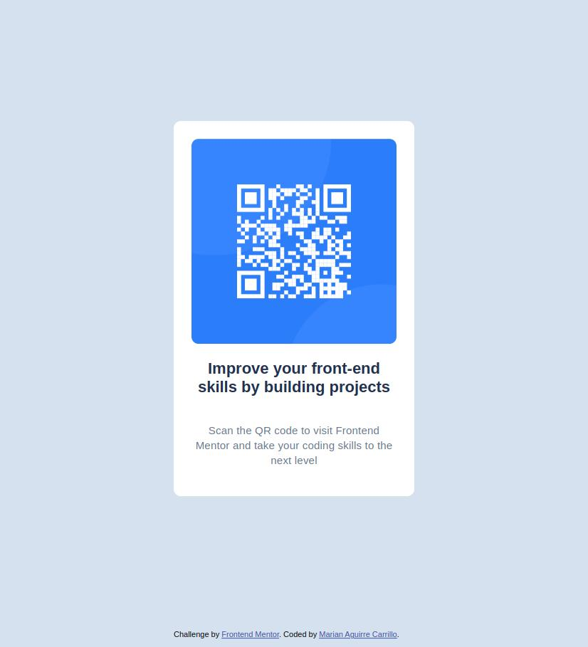

# Frontend Mentor - QR code component solution

This is a solution to the [QR code component challenge on Frontend Mentor](https://www.frontendmentor.io/challenges/qr-code-component-iux_sIO_H).

## Table of contents

- [Overview](#overview)
  - [Screenshot](#screenshot)
  - [Links](#links)
- [My process](#my-process)
  - [Built with](#built-with)
  - [What I learned](#what-i-learned)
- [Author](#author)

## Overview

### Screenshot

### Links

- Solution URL: [Repository](https://github.com/MarianAguirre/QR-code-component)
- Live Site URL: [QR-code](https://marianaguirre.github.io/QR-code-component/)

## My process

### Built with

- Semantic HTML5 markup
- CSS custom properties
- Flexbox

### What I learned

Review the use of display flex and absolute positioning for the correct positioning of the QR code and other elements, to be responsive on desktop and mobile devices.

## Author

- Frontend Mentor - [@MarianAguirre](https://www.frontendmentor.io/profile/MarianAguirre)
